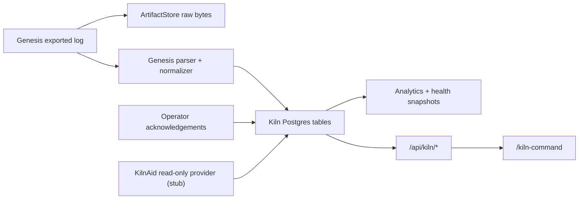

# Genesis Overlay Architecture

## Intent

The Genesis Overlay Layer lives inside `studio-brain` as an operational plane, not a controller replacement.

- Genesis remains the authority for heat execution and local safety-critical actions.
- Studio Brain becomes the authority for queueing, operator acknowledgements, raw evidence, analytics, and job linkage.
- KilnAid is treated as a future read-only observation provider unless a vendor-supported write path is explicitly detected and enabled later.

## MVP Scope

Phase 1 in this repo now includes:

- kiln inventory and capability fingerprints
- raw Genesis artifact preservation in the artifact store
- normalized imports into Postgres-backed kiln tables
- firing runs, events, telemetry, health snapshots, and operator actions
- watched-folder Genesis ingestion
- manual Genesis upload endpoint
- operator acknowledgement endpoints
- queue-aware firing orchestration
- authenticated `/kiln-command` operator view

Not included in MVP:

- controller write commands
- auth bypass or traffic interception
- firmware or electrical-layer intervention
- portal write-back coupling

## Data Flow

## Core Models

- `Kiln`: hardware/controller identity plus current fingerprinted capabilities
- `KilnCapabilityDocument`: versioned evidence-backed capability fingerprint
- `FiringRun`: run state, queue state, portal references, and control posture
- `FiringEvent`: evidence graph for controller, operator, or inferred events
- `TelemetryPoint`: normalized temperature, set point, segment, and power data
- `KilnHealthSnapshot`: advisory health analytics with confidence notes
- `OperatorAction`: human acknowledgement trail
- `RawArtifactRef`: immutable pointer to preserved original evidence

## Control Posture Rules

The UI and APIs must remain honest:

- `Observed only`: Studio Brain has evidence but no human-confirmed start
- `Human-triggered`: an operator confirmed the local start on Genesis
- `Supported write path`: only shown when a supported vendor write action is both detected and explicitly enabled

## Runtime Hooks

`studio-brain/src/index.ts` now wires:

- a kiln watch scheduler with its own runtime status block
- a read-only KilnAid provider placeholder
- kiln-aware HTTP routes and the native command page

## Safety Boundary

The overlay intentionally stops short of remote kiln control. Any future write capability must be:

1. vendor-supported
2. capability-detected
3. feature-flagged
4. disabled by default

Until then, Studio Brain coordinates people and evidence, while Genesis remains the actuator.
