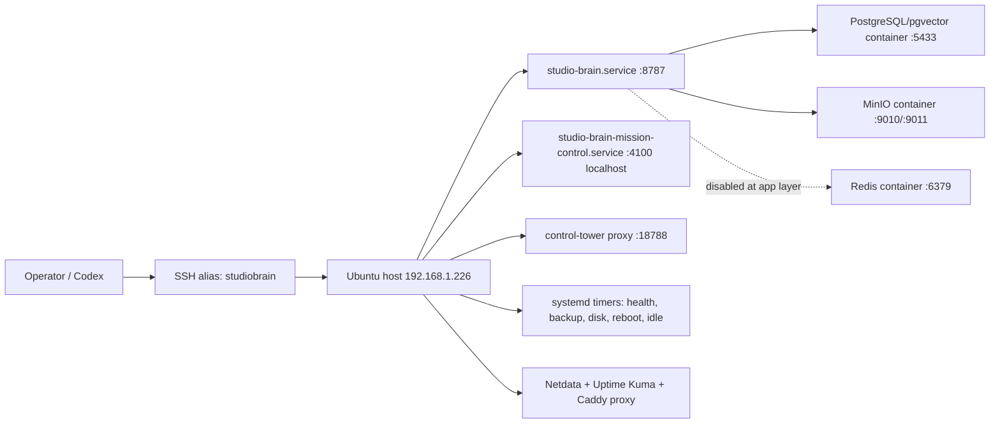

# Studio Brain System Inventory

Snapshot time: 2026-05-06 07:00-07:02 UTC, from `D:\monsoonfire-portal-idle-reconcile` against SSH alias `studiobrain` and LAN API `http://192.168.1.226:8787`.

## Host Assumptions And Known Facts

- Studio Brain LAN API: `http://192.168.1.226:8787`.
- SSH alias: `studiobrain`, user `wuff`, key path reported by the repo wrapper as `C:\Users\micah\.ssh\studiobrain-codex`.
- Live repo path: `/home/wuff/monsoonfire-portal`.
- Windows repo path for reviewable changes: `D:\monsoonfire-portal`.
- This inventory is read-only. No services were restarted, no packages were upgraded, no Docker objects were pruned, and no database writes were made.
- The live host checkout is not currently clean: it is on `codex/next-fix-20260312...origin/codex/next-fix-20260312 [gone]` with 512 dirty or untracked paths.

## OS And Kernel

- OS: Ubuntu 25.10 (`PRETTY_NAME="Ubuntu 25.10"`).
- Kernel: `6.17.0-22-generic`.
- Uptime: 19 days, 8 hours at collection time.
- Hostname: `studiobrain`.
- Primary operator user: `wuff` (`uid=1000`), member of `sudo`, `docker`, and `adm`.

## Package Manager State

- Reboot required: yes. `/var/run/reboot-required.pkgs` listed `linux-image-6.17.0-23-generic` and `linux-base`.
- `unattended-upgrades.service`: enabled and active.
- Pending upgrades include cloud-init, Docker Engine/Compose (`29.4.2`, compose `5.1.3`), `containerd.io`, `systemd`, `nodejs` 25.9.0, `rsyslog`, `snapd`, Ubuntu Pro client, release upgrader, and kernel-related packages.
- `apt-daily-upgrade.service` no longer appears in `systemctl --failed`; `systemctl show` reported `Result=success`, `ExecMainStatus=0`, `ActiveState=inactive`, and `SubState=dead`. The prior OOM event remains operational evidence because the kernel log showed `unattended-upgr` killed on 2026-05-05 06:56 UTC.

## Mounted Filesystems

| Mount | Type | Size | Used | Available | Use |
| --- | --- | ---: | ---: | ---: | ---: |
| `/` | ext4 on LVM | 914G | 126G | 751G | 15% |
| `/boot` | ext4 | 2.0G | 240M | 1.6G | 14% |
| `/boot/efi` | vfat | 1.1G | 6.3M | 1.1G | 1% |
| `/tmp` | tmpfs | 16G | 55M | 16G | 1% |

Inodes are healthy: `/` has about 59M inodes with 2% used.

## Disk Usage Risks

- `/home/wuff`: 91G.
- `/home/wuff/monsoonfire-portal`: 44G.
- `/home/wuff/imports`: 45G.
- Docker system data: 8.984GB in local volumes, 4.397GB in images, and 300.3MB build cache. Non-root `du` against `/var/lib/docker` is not reliable.
- `/home/wuff/backups`: 3.5G.
- `/home/wuff/studio-brain-mission-control`: 4.0G.
- `/home/wuff/.npm`: 4.2G.
- `/home/wuff/.cache`: 3.8G.
- `/var/log`: 93M.
- `/tmp`: 55M.
- `/var/backups/studio-brain`: 8.0K observed through the non-root read.

Disk pressure is not immediate, but imports are now the clearest near-term capacity watch item. The 07:11 UTC import pressure report measured `/home/wuff/imports` at 45G with two 22G PST files and two smaller zip archives; all were last modified about 63 days earlier and classified `requires_human_approval`. Because the earlier 2026-05-06 snapshot reported 23G, treat this as an observed size discrepancy until growth history is proven.

## Memory And Swap

- RAM: 30Gi total, 3.9Gi used, 15Gi free, 26Gi available.
- Swap: 8.0Gi total, 445Mi used.
- Load average at collection: about `0.23, 0.37, 0.49`.
- One OOM event was observed in the last 14 days: `apt-daily-upgrade.service` caused an OOM kill of `unattended-upgr`.

## Systemd Services Relevant To Studio Brain

User-scoped services under `wuff`:

| Unit | State | Restart | PID | Memory |
| --- | --- | --- | ---: | ---: |
| `studio-brain.service` | active/running | always | 525535 | ~244M |
| `studio-brain-mission-control.service` | active/running | on-failure | 3983284 | ~481M |

System services/timers:

| Unit | State | Notes |
| --- | --- | --- |
| `studio-brain-control-tower-proxy.service` | active/running | system service, restart always |
| `studio-brain-namecheap-tunnel.service` | active/running | system service, restart always |
| `studio-brain-backup.timer` | active/waiting | daily 03:45 UTC |
| `studio-brain-healthcheck.timer` | active/waiting | every 5 minutes |
| `studio-brain-disk-alert.timer` | active/waiting | every 15 minutes |
| `studio-brain-reboot-watch.timer` | active/waiting | every 15 minutes |
| `studio-brain-idle-worker.timer` | active/waiting | every 4 hours after inactive, randomized delay |
| `studio-brain-idle-worker-overnight.timer` | active/waiting | nightly around 02:30 UTC |

The idle-worker timers are present on the host. This branch adds matching tracked unit and wrapper files under `config/studiobrain/systemd`; applying them on the host remains an explicit install/reconcile action, not part of read-only discovery.

## Failed Units

- `dailyaidecheck.service`: failed, `ExecMainStatus=1`.
- `snap.canonical-livepatch.canonical-livepatchd.service`: failed, 5 restarts.
- `systemd-networkd-wait-online.service`: failed, `ExecMainStatus=1`.

`apt-daily-upgrade.service` was no longer failed in the 07:00 UTC snapshot, but the host now requires a reboot for kernel packages.

## Cron And Timer Inventory

User crontab for `wuff`:

```cron
*/15 * * * * cd /home/wuff/monsoonfire-portal && /usr/bin/node ./scripts/mail-profile-sync.mjs --json >> /home/wuff/monsoonfire-portal/imports/mail/runs/mail-profile-sync-cron.log 2>&1
```

Other notable cron entries:

- `/etc/cron.daily/dailyaidecheck`
- `/etc/cron.weekly/studiobrain-lynis`
- standard `apt`, `dpkg`, `logrotate`, `man-db`, and `sysstat` entries.

## Open Ports

Observed listeners:

- `0.0.0.0:22` and `[::]:22`: SSH.
- `0.0.0.0:25` and `[::]:25`: Postfix.
- `192.168.1.226:8787`: Studio Brain API.
- `127.0.0.1:4100`: Mission Control.
- `127.0.0.1:18788`: Control Tower proxy.
- `0.0.0.0:5433` and `[::]:5433`: PostgreSQL container host port.
- `127.0.0.1:6379`: Redis.
- `127.0.0.1:9010` and `127.0.0.1:9011`: MinIO API/console.
- `127.0.0.1:8889`: Docker-published local service, role to confirm.
- `127.0.0.1:4317` and `127.0.0.1:4318`: OpenTelemetry collector.
- `127.0.0.1:19999`: Netdata.
- `127.0.0.1:3001`: Uptime Kuma.
- `192.168.1.226:18080` and `192.168.1.226:18081`: monitoring proxy.
- `127.0.0.1:8080`: SearXNG.
- `127.0.0.1:631` and `[::1]:631`: CUPS.

Follow-up network exposure capture on 2026-05-06 01:10 UTC shows `ufw` enabled and active by systemd, but non-root `ufw status`, `nft`, and `iptables` rule visibility required a privileged read. Treat firewall rule coverage as unknown until `sudo ufw status numbered verbose` or equivalent is captured. `fail2ban` is active, but jail details also required a privileged read in the follow-up.

SSH posture requires effective-config confirmation. Readable config fragments and prior diagnostics show password-based settings need review:

- `passwordauthentication yes`
- `kbdinteractiveauthentication yes`
- `AuthenticationMethods any`

## Docker Version And Compose Files

- Docker Engine: 29.4.0.
- Docker Compose: v5.1.2. Package updates are available for Docker Engine 29.4.2 and Compose 5.1.3.
- Compose projects reported by `docker compose ls`:
  - `studio-brain`: `/home/wuff/monsoonfire-portal/studio-brain/docker-compose.yml`
  - `monitoring`: `/home/wuff/monitoring/docker-compose.yml`
  - `searxng`: `/home/wuff/searxng/docker-compose.yml`
- Tracked compose files in this repo:
  - `studio-brain/docker-compose.yml`
  - `studio-brain/docker-compose.proxy.yml`
  - `config/studiobrain/monitoring/docker-compose.yml`

## Running Containers And Roles

| Container | Role | Status | Image |
| --- | --- | --- | --- |
| `studiobrain_postgres` | primary PostgreSQL and pgvector state | healthy | `pgvector/pgvector:pg16` |
| `studiobrain_redis` | queue/event primitives, currently app reports Redis disabled | healthy | `redis:7-alpine` |
| `studiobrain_minio` | artifact/object storage | healthy | `minio/minio:latest` |
| `studiobrain_otel_collector` | optional OpenTelemetry collector | up, no healthcheck | `otel/opentelemetry-collector-contrib:latest` |
| `netdata` | host/container metrics | healthy | `netdata/netdata:stable` |
| `uptime-kuma` | synthetic monitors | healthy | `louislam/uptime-kuma:1` |
| `monitoring-proxy` | Caddy bridge for monitoring | up, no healthcheck | `caddy:2-alpine` |
| `searxng-searxng-1` | search service | up, no healthcheck | `searxng/searxng:latest` |
| `searxng-redis-1` | SearXNG Redis | up, no healthcheck | `redis:7-alpine` |

Docker space summary:

- Images: 9 total, 4.397GB.
- Containers: 9 total, all active.
- Local volumes: 8 total, 5 active, 8.984GB.
- Build cache: 300.3MB, all reclaimable.

## PostgreSQL Version And Connection Method

- PostgreSQL: 16.13 inside `studiobrain_postgres`.
- Image: `pgvector/pgvector:pg16`.
- Host port: `5433 -> 5432`, bound to all interfaces by current Compose default.
- Database: `monsoonfire_studio_os`.
- Database size: 8333MB (`8738126871` bytes).
- Extensions: `pg_stat_statements`, `pg_trgm`, `pgcrypto`, `plpgsql`, `vector`.
- Connection snapshot: 7 sessions, 0 idle-in-transaction sessions, and 0 ungranted locks.
- App health reports PostgreSQL connected with low single-digit millisecond latency.

## Application Components And Dependency Map



## Current Live API Health

- `/healthz`: `ok=true`.
- `/readyz`: previously `ok=true`, PostgreSQL connected, state snapshot age 13 minutes; not re-sampled in this refresh.
- `/health/dependencies`: PostgreSQL, artifact store, vector store, skill registry, and skill sandbox OK; Redis/event bus/kilnaid provider disabled.
- `/api/status`: overseer status remains `critical` with 6 signal gaps and 8 actions.
- Mission Control `/api/mission-control/health`: `ok=true`; `codexIngest` reported 246 accepted requests, 1041 accepted events, 0 empty payload requests, 0 rate-limited requests, and `skipRatio=0`.
