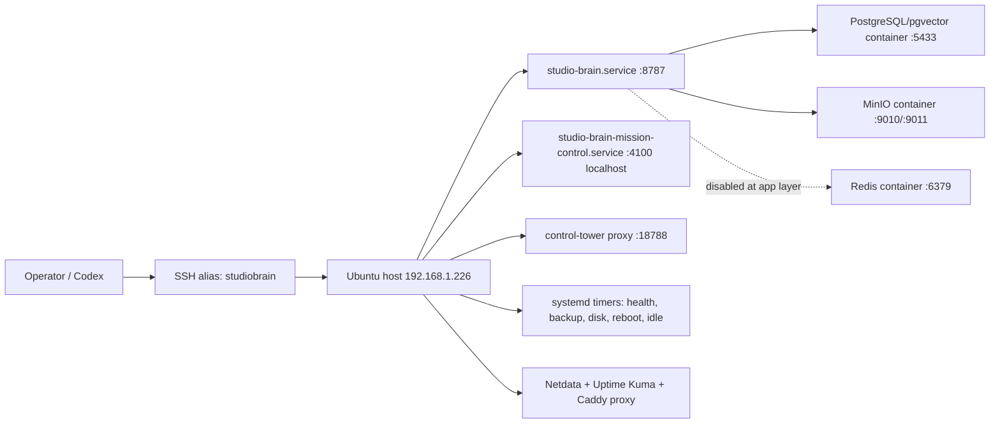

# Studio Brain System Inventory

Snapshot time: 2026-05-06 00:16-00:20 UTC, from `D:\monsoonfire-portal-ops-doctor` against SSH alias `studiobrain` and LAN API `http://192.168.1.226:8787`.

## Host Assumptions And Known Facts

- Studio Brain LAN API: `http://192.168.1.226:8787`.
- SSH alias: `studiobrain`, user `wuff`, key path reported by the repo wrapper as `C:\Users\micah\.ssh\studiobrain-codex`.
- Live repo path: `/home/wuff/monsoonfire-portal`.
- Windows repo path for reviewable changes: `D:\monsoonfire-portal`.
- This inventory is read-only. No services were restarted, no packages were upgraded, no Docker objects were pruned, and no database writes were made.
- The live host checkout is not currently clean: it is on `codex/next-fix-20260312...origin/codex/next-fix-20260312 [gone]` with 211 tracked dirty files.

## OS And Kernel

- OS: Ubuntu 25.10 (`PRETTY_NAME="Ubuntu 25.10"`).
- Kernel: `6.17.0-22-generic`.
- Uptime: 19 days, 1 hour at collection time.
- Hostname: `studiobrain`.
- Primary operator user: `wuff` (`uid=1000`), member of `sudo`, `docker`, and `adm`.

## Package Manager State

- Reboot required: no `/var/run/reboot-required` file at collection time.
- `unattended-upgrades.service`: enabled and active.
- Pending upgrades include kernel packages (`linux-generic` 6.17.0-23), Docker Engine/Compose (`29.4.2`, compose `5.1.3`), `curl`, `systemd`, `nodejs` 25.9.0, `containerd.io`, `rsyslog`, `sed`, and `snapd`.
- Failed units include `apt-daily-upgrade.service`; systemd reports `Result=oom-kill`, and the kernel log shows `unattended-upgr` was killed by the OOM killer on 2026-05-05 06:56 UTC.

## Mounted Filesystems

| Mount | Type | Size | Used | Available | Use |
| --- | --- | ---: | ---: | ---: | ---: |
| `/` | ext4 on LVM | 914G | 124G | 753G | 15% |
| `/boot` | ext4 | 2.0G | 240M | 1.6G | 14% |
| `/boot/efi` | vfat | 1.1G | 6.3M | 1.1G | 1% |
| `/tmp` | tmpfs | 16G | 28M | 16G | 1% |

Inodes are healthy: `/` has about 59M inodes with 2% used.

## Disk Usage Risks

- `/home/wuff`: 89G.
- `/home/wuff/monsoonfire-portal`: 44G.
- `/home/wuff/imports`: 23G.
- `/var/lib/docker`: 12G.
- `/home/wuff/backups`: 2.4G.
- `/home/wuff/studio-brain-mission-control`: 2.8G.
- `/home/wuff/.npm`: 4.2G.
- `/home/wuff/.cache`: 3.8G.
- `/var/log`: 84M.
- `/tmp`: 28M.
- `/var/backups/studio-brain`: 756K.

Disk pressure is not immediate, but repository/import/cache growth is the largest long-term storage concern.

## Memory And Swap

- RAM: 30Gi total, 4.5Gi used, 19Gi free, 25Gi available.
- Swap: 8.0Gi total, 448Mi used.
- Load average at collection: about `1.36, 1.28, 1.11`.
- One OOM event was observed in the last 14 days: `apt-daily-upgrade.service` caused an OOM kill of `unattended-upgr`.

## Systemd Services Relevant To Studio Brain

User-scoped services under `wuff`:

| Unit | State | Restart | PID | Memory |
| --- | --- | --- | ---: | ---: |
| `studio-brain.service` | active/running | always | 525535 | ~286M |
| `studio-brain-mission-control.service` | active/running | on-failure | 3552280 | ~980M |

System services/timers:

| Unit | State | Notes |
| --- | --- | --- |
| `studio-brain-control-tower-proxy.service` | active/running | system service, restart always |
| `studio-brain-namecheap-tunnel.service` | active/running | system service, restart always |
| `studio-brain-backup.timer` | active/waiting | daily 03:45 UTC |
| `studio-brain-healthcheck.timer` | active/waiting | every 5 minutes |
| `studio-brain-disk-alert.timer` | active/waiting | every 15 minutes |
| `studio-brain-reboot-watch.timer` | active/waiting | every 15 minutes |
| `studio-brain-idle-worker.timer` | active/waiting | every 4 hours after inactive, randomized delay |
| `studio-brain-idle-worker-overnight.timer` | active/waiting | nightly around 02:30 UTC |

The idle-worker timers are present on the host, but the clean `origin/main` checkout used for this PR does not contain corresponding tracked unit files under `config/studiobrain/systemd`.

## Failed Units

- `apt-daily-upgrade.service`: failed, `Result=oom-kill`.
- `dailyaidecheck.service`: failed, `ExecMainStatus=1`.
- `snap.canonical-livepatch.canonical-livepatchd.service`: failed, 5 restarts.
- `systemd-networkd-wait-online.service`: failed, `ExecMainStatus=1`.

## Cron And Timer Inventory

User crontab for `wuff`:

```cron
*/15 * * * * cd /home/wuff/monsoonfire-portal && /usr/bin/node ./scripts/mail-profile-sync.mjs --json >> /home/wuff/monsoonfire-portal/imports/mail/runs/mail-profile-sync-cron.log 2>&1
```

Other notable cron entries:

- `/etc/cron.daily/dailyaidecheck`
- `/etc/cron.weekly/studiobrain-lynis`
- standard `apt`, `dpkg`, `logrotate`, `man-db`, and `sysstat` entries.

## Open Ports

Observed listeners:

- `0.0.0.0:22` and `[::]:22`: SSH.
- `0.0.0.0:25` and `[::]:25`: Postfix.
- `192.168.1.226:8787`: Studio Brain API.
- `127.0.0.1:4100`: Mission Control.
- `127.0.0.1:18788`: Control Tower proxy.
- `0.0.0.0:5433` and `[::]:5433`: PostgreSQL container host port.
- `127.0.0.1:6379`: Redis.
- `127.0.0.1:9010` and `127.0.0.1:9011`: MinIO API/console.
- `127.0.0.1:19999`: Netdata.
- `127.0.0.1:3001`: Uptime Kuma.
- `192.168.1.226:18080` and `192.168.1.226:18081`: monitoring proxy.
- `127.0.0.1:8080`: SearXNG.

`ufw` is inactive. `fail2ban` is active for `sshd` with 0 current bans and 2 total failed attempts.

SSH posture from `sshd -T`:

- `permitrootlogin without-password`
- `pubkeyauthentication yes`
- `passwordauthentication yes`
- `kbdinteractiveauthentication yes`
- `x11forwarding yes`

## Docker Version And Compose Files

- Docker Engine: 29.4.0.
- Docker Compose: v5.1.2.
- Compose projects reported by `docker compose ls`:
  - `studio-brain`: `/home/wuff/monsoonfire-portal/studio-brain/docker-compose.yml`
  - `monitoring`: `/home/wuff/monitoring/docker-compose.yml`
  - `searxng`: `/home/wuff/searxng/docker-compose.yml`
- Tracked compose files in this repo:
  - `studio-brain/docker-compose.yml`
  - `studio-brain/docker-compose.proxy.yml`
  - `config/studiobrain/monitoring/docker-compose.yml`

## Running Containers And Roles

| Container | Role | Status | Image |
| --- | --- | --- | --- |
| `studiobrain_postgres` | primary PostgreSQL and pgvector state | healthy | `pgvector/pgvector:pg16` |
| `studiobrain_redis` | queue/event primitives, currently app reports Redis disabled | healthy | `redis:7-alpine` |
| `studiobrain_minio` | artifact/object storage | healthy | `minio/minio:latest` |
| `studiobrain_otel_collector` | optional OpenTelemetry collector | up, no healthcheck | `otel/opentelemetry-collector-contrib:latest` |
| `netdata` | host/container metrics | healthy | `netdata/netdata:stable` |
| `uptime-kuma` | synthetic monitors | healthy | `louislam/uptime-kuma:1` |
| `monitoring-proxy` | Caddy bridge for monitoring | up, no healthcheck | `caddy:2-alpine` |
| `searxng-searxng-1` | search service | up, no healthcheck | `searxng/searxng:latest` |
| `searxng-redis-1` | SearXNG Redis | up, no healthcheck | `redis:7-alpine` |

Docker space summary:

- Images: 9 total, 4.397GB.
- Containers: 9 total, all active.
- Local volumes: 8 total, 5 active, 9.303GB.
- Build cache: 300.3MB, all reclaimable.

## PostgreSQL Version And Connection Method

- PostgreSQL: 16.13 inside `studiobrain_postgres`.
- Image: `pgvector/pgvector:pg16`.
- Host port: `5433 -> 5432`, bound to all interfaces by current Compose default.
- Database: `monsoonfire_studio_os`.
- Extensions: `pg_stat_statements`, `pg_trgm`, `pgcrypto`, `plpgsql`, `vector`.
- App health reports PostgreSQL connected with low single-digit millisecond latency.

## Application Components And Dependency Map



## Current Live API Health

- `/healthz`: `ok=true`.
- `/readyz`: `ok=true`, PostgreSQL connected, state snapshot age 13 minutes.
- `/health/dependencies`: PostgreSQL, artifact store, vector store, skill registry, and skill sandbox OK; Redis/event bus/kilnaid provider disabled.
- `/api/status`: scheduler healthy, `computeStudioState` has 210 successes and 0 failures since runtime start on 2026-05-03; overseer status remains `critical` with 6 signal gaps and 8 actions.
